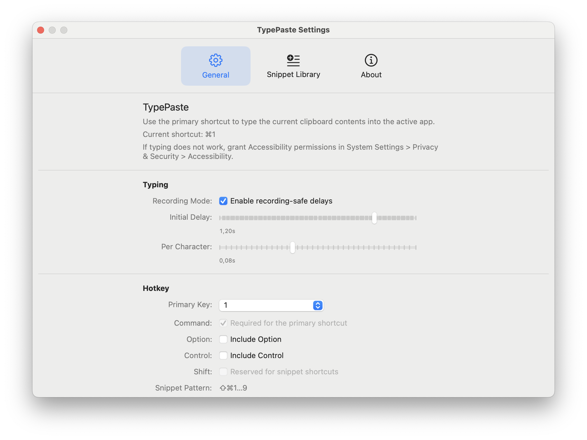

# TypePaste


TypePaste is a lightweight macOS menu-bar app that reads the current clipboard text and types it into the active app as if you were typing. It is built for product demos and screen recordings where you want a natural, human-like typing effect without manually retyping content.


## Screenshots

**Demo**


**Settings**




## Features
- Global hotkey to type clipboard contents into any app.
- Human-like typing with configurable delays.
- Recording mode that increases delays to avoid dropped characters in screen recordings.
- Menu-bar UI with quick access to settings.

**Notes**
- The default hotkey is `⌘1`. You can change the hotkey in Settings.
- The app uses "Accessibility" to post keyboard events, so it must be allowed in "Settings" > "Privacy & Security".

## How-To

### Install

**Install from DMG (GitHub Releases)**
1. Download the latest `.dmg` from [Releases](https://github.com/trinixlabs/TypePaste/releases).
2. Open the DMG and drag `TypePaste.app` to `Applications`.
3. Launch TypePaste from `Applications`.
4. On first launch, if macOS blocks the app: right-click `TypePaste.app` -> `Open` -> `Open`.

**Install with Homebrew**
1. Run:
```bash
brew tap trinixlabs/tap
brew install --cask typepaste
```
2. Launch TypePaste from `Applications`.
3. On first launch, if macOS blocks the app: right-click `TypePaste.app` -> `Open` -> `Open`.

### First Launch on macOS

TypePaste is an open-source project and release builds are distributed unsigned.
On first launch, macOS may show:

- `"TypePaste" cannot be opened because Apple cannot check it for malicious software.`
- `"TypePaste" is damaged and can't be opened. You should move it to the Bin.`

To run it anyway:

1. In Finder, right-click `TypePaste.app` and choose `Open`.
2. Click `Open` again in the warning dialog.

If Finder still blocks it, use:

- `System Settings -> Privacy & Security` and click `Open Anyway` for TypePaste.

Alternative Terminal path:

```bash
xattr -dr com.apple.quarantine /Applications/TypePaste.app
open /Applications/TypePaste.app
```

If needed, remove all extended attributes and try again:

```bash
xattr -cr /Applications/TypePaste.app
open /Applications/TypePaste.app
```

### Develop

**How To Run**
1. Open `TypePaste.xcodeproj` in Xcode.
2. Select the `TypePaste` scheme.
3. Press `Run`.
4. When prompted, grant Accessibility permissions in `System Settings > Privacy & Security > Accessibility`.

**How To Build**
1. Open `TypePaste.xcodeproj` in Xcode.
2. Select the `TypePaste` scheme.
3. Use `Product > Build` or `Product > Archive` to create a build.

**Build App**
1. Open `TypePaste.xcodeproj` in Xcode.
2. Select the `TypePaste` scheme.
3. Use `Product > Archive` to create a release build.
4. In Organizer: `Distribute App` → `Custom` → `Copy App`.
5. Choose “Do not sign” and export the `.app`.
6. Compress the `.app` into a `.zip` for distribution.
